<div align="center">


[](https://humancto.github.io/legacy-games/)

<br/>

[](https://humancto.github.io/legacy-games/)
&nbsp;
[](https://github.com/humancto/legacy-games)

<br/>

[](https://developer.mozilla.org/en-US/docs/Web/API/Canvas_API)
[](https://developer.mozilla.org/en-US/docs/Web/JavaScript)
[]()
[](https://humancto.github.io/legacy-games/)
[]()
[](LICENSE)
[]()

---

**Built by [Human CTO](https://www.humancto.com/)** &nbsp;|&nbsp; [LinkedIn](https://www.linkedin.com/in/archithr/) &nbsp;|&nbsp; [GitHub](https://github.com/humancto)

---

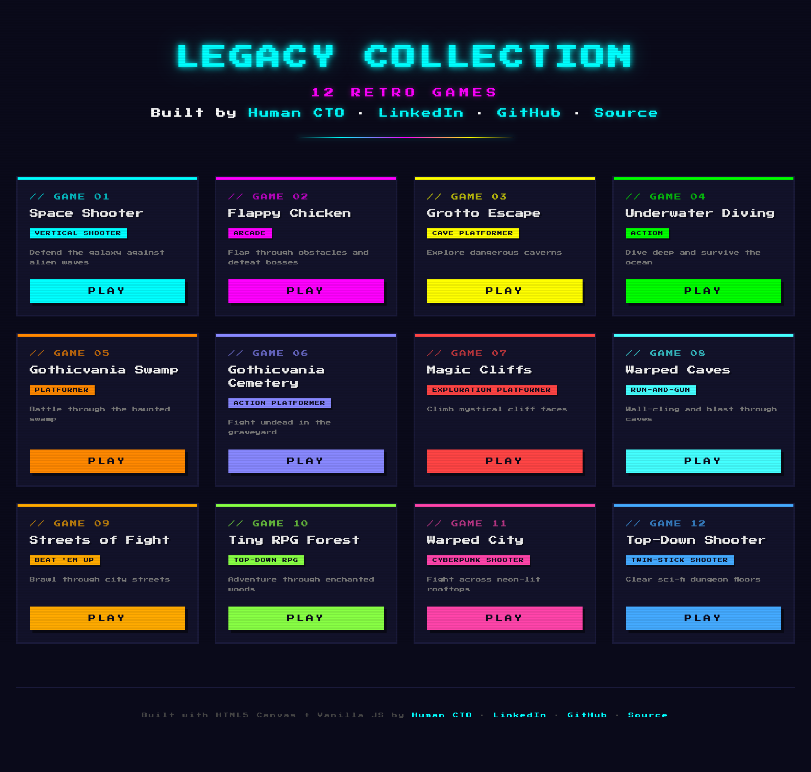

<sub>Retro-themed game launcher hub with all 12 playable games</sub>

</div>

<br/>

## 🕹️ Game Gallery

<table>
<tr>
<td align="center" width="33%">
<a href="https://humancto.github.io/legacy-games/space-shooter/">
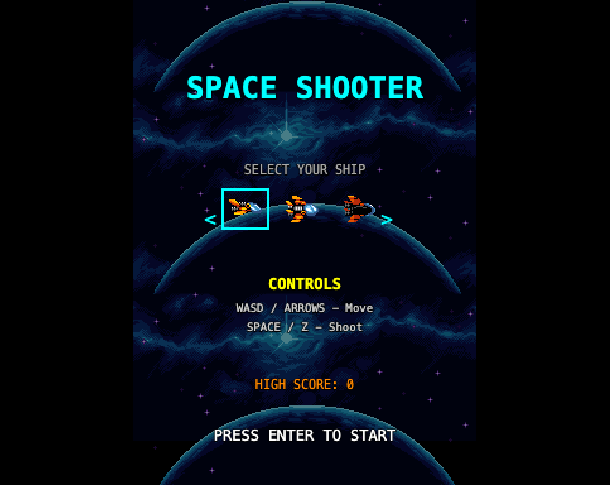
</a>
<br/>
<b>🚀 Space Shooter</b><br/>
<code>Vertical Shooter</code> · <code>WASD + Space</code>
</td>
<td align="center" width="33%">
<a href="https://humancto.github.io/legacy-games/flappy-chicken/">

</a>
<br/>
<b>🐔 Flappy Chicken</b><br/>
<code>Arcade</code> · <code>Space to flap</code>
</td>
<td align="center" width="33%">
<a href="https://humancto.github.io/legacy-games/underwater-diving/">
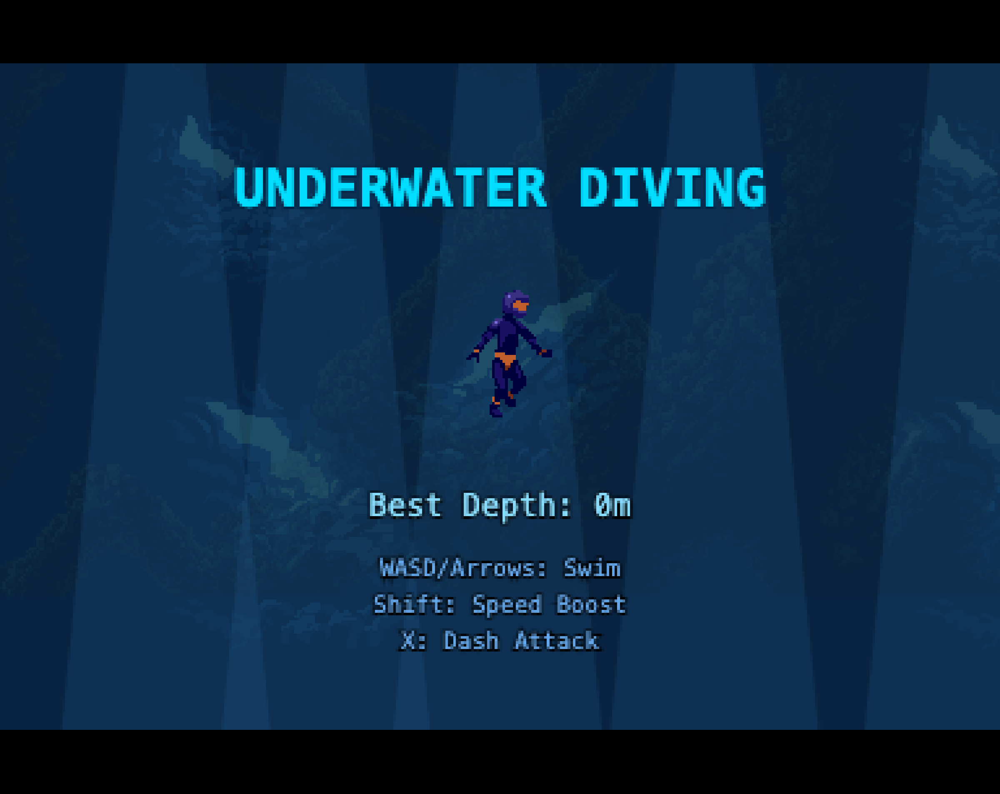
</a>
<br/>
<b>🤿 Underwater Diving</b><br/>
<code>Action</code> · <code>WASD + Shift</code>
</td>
</tr>
<tr>
<td align="center" width="33%">
<a href="https://humancto.github.io/legacy-games/gothicvania-swamp/">
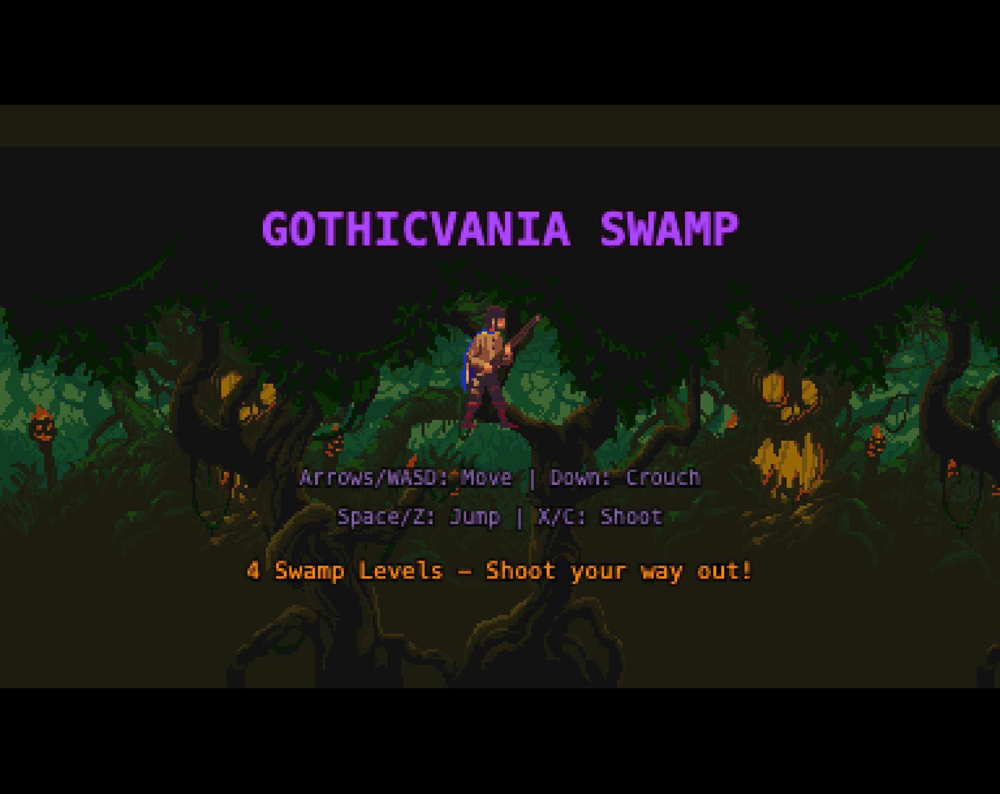
</a>
<br/>
<b>🌿 Gothicvania Swamp</b><br/>
<code>Platformer</code> · <code>WASD + Z/X</code>
</td>
<td align="center" width="33%">
<a href="https://humancto.github.io/legacy-games/gothicvania-cemetery/">
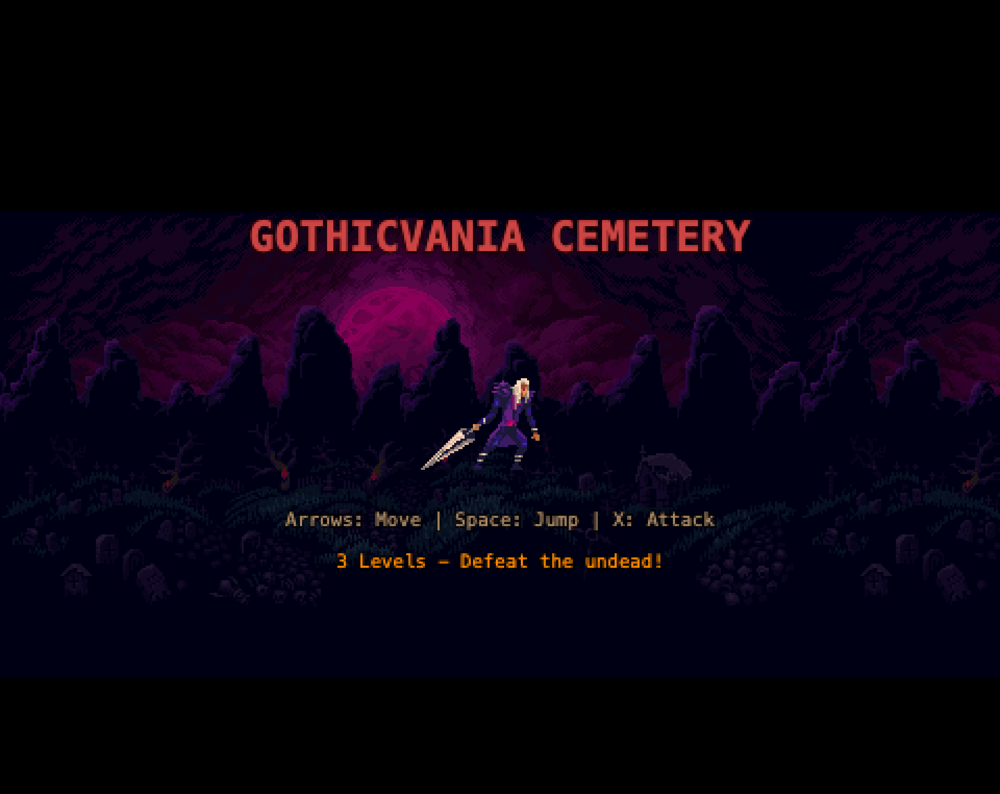
</a>
<br/>
<b>⚰️ Gothicvania Cemetery</b><br/>
<code>Action Platformer</code> · <code>WASD + Z</code>
</td>
<td align="center" width="33%">
<a href="https://humancto.github.io/legacy-games/magic-cliffs/">
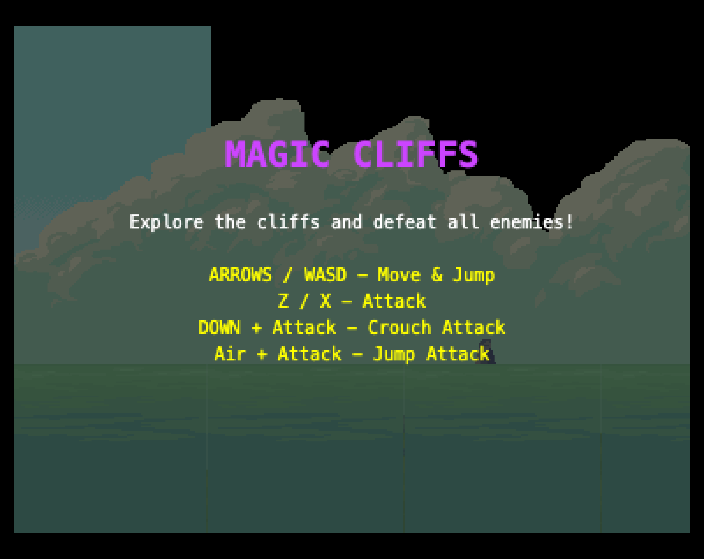
</a>
<br/>
<b>🏔️ Magic Cliffs</b><br/>
<code>Exploration Platformer</code> · <code>WASD + Z/X</code>
</td>
</tr>
<tr>
<td align="center" width="33%">
<a href="https://humancto.github.io/legacy-games/warped-caves/">
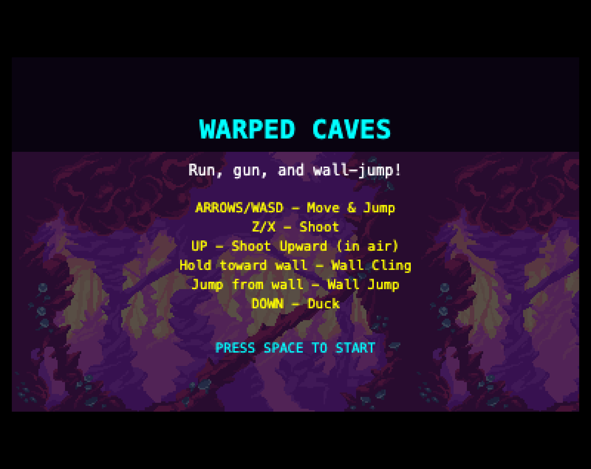
</a>
<br/>
<b>🦇 Warped Caves</b><br/>
<code>Run-and-Gun</code> · <code>WASD + Z/X</code>
</td>
<td align="center" width="33%">
<a href="https://humancto.github.io/legacy-games/streets-of-fight/">
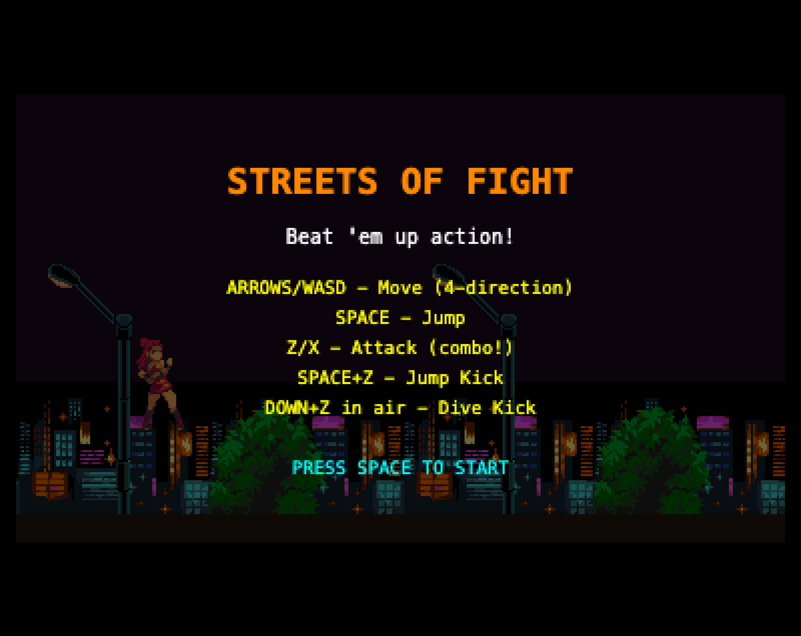
</a>
<br/>
<b>👊 Streets of Fight</b><br/>
<code>Beat 'em Up</code> · <code>WASD + Z/X/C</code>
</td>
<td align="center" width="33%">
<a href="https://humancto.github.io/legacy-games/tiny-rpg-forest/">
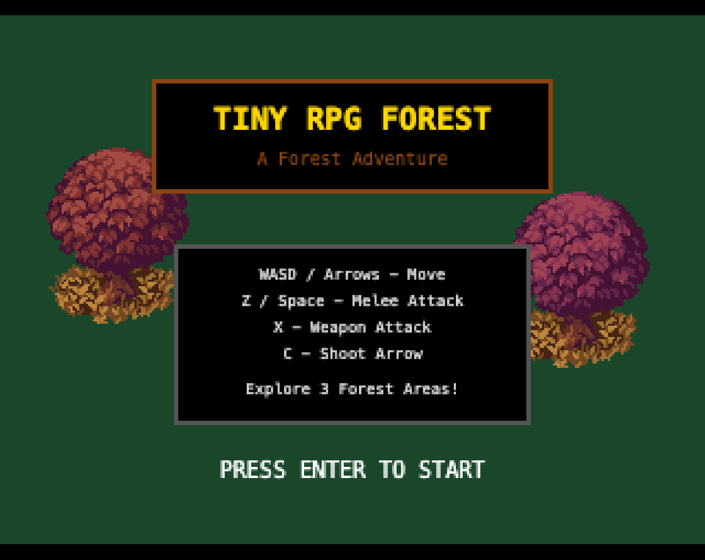
</a>
<br/>
<b>🌲 Tiny RPG Forest</b><br/>
<code>Top-Down RPG</code> · <code>WASD + Z/X/C</code>
</td>
</tr>
<tr>
<td align="center" width="33%">
<a href="https://humancto.github.io/legacy-games/warped-city/">
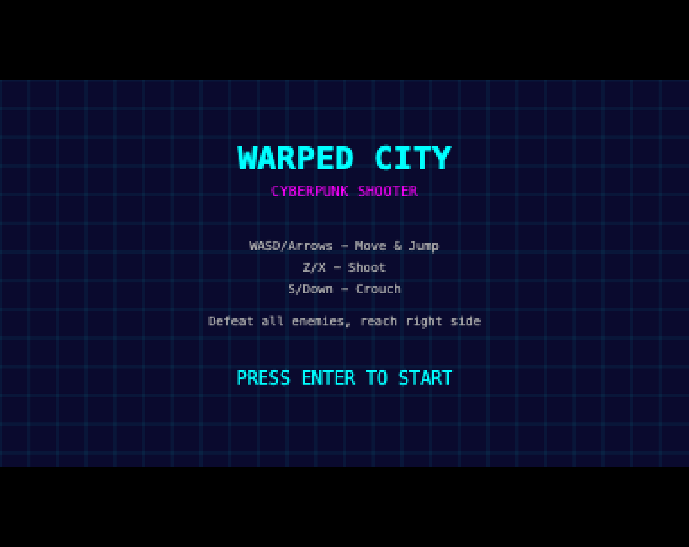
</a>
<br/>
<b>🌃 Warped City</b><br/>
<code>Cyberpunk Shooter</code> · <code>WASD + Z/X</code>
</td>
<td align="center" width="33%">
<a href="https://humancto.github.io/legacy-games/top-down-shooter/">
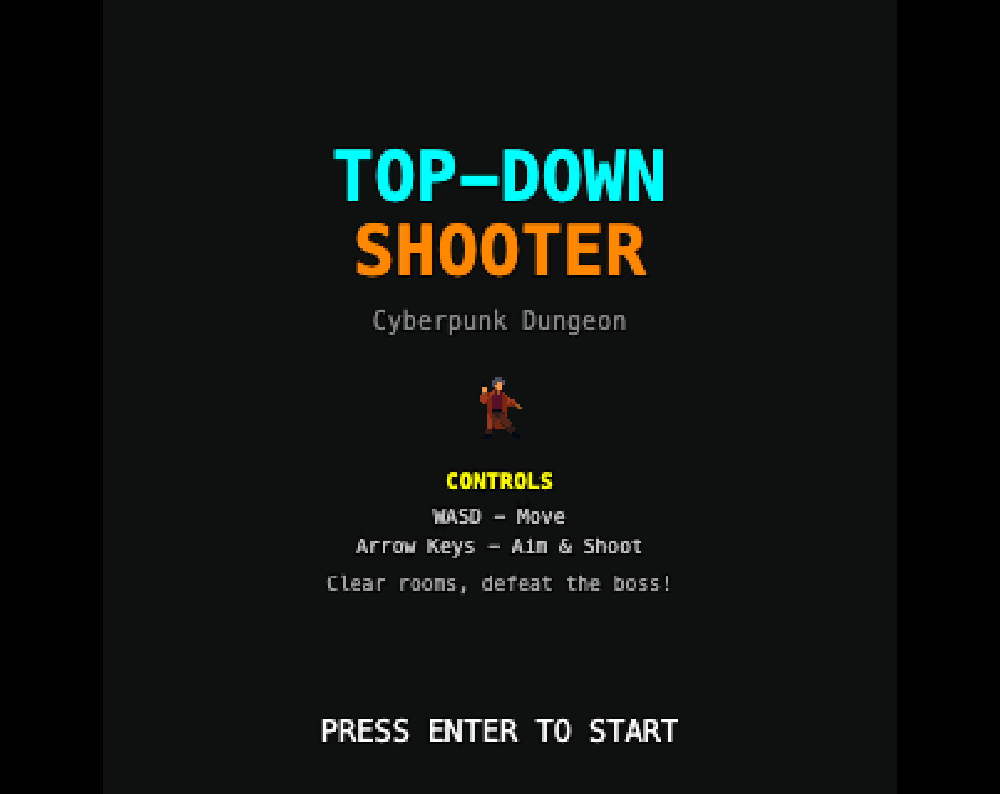
</a>
<br/>
<b>🔫 Top-Down Shooter</b><br/>
<code>Twin-Stick Shooter</code> · <code>WASD + Arrows</code>
</td>
<td align="center" width="33%">
<a href="https://humancto.github.io/legacy-games/grotto-escape/">

</a>
<br/>
<b>🕳️ Grotto Escape</b><br/>
<code>Cave Platformer</code> · <code>WASD + Z/X</code>
</td>
</tr>
</table>

<br/>

## 🎮 All 12 Games

|  #  | Game                     | Genre                  | Controls      |                                                                         |
| :-: | ------------------------ | ---------------------- | ------------- | :---------------------------------------------------------------------: |
|  1  | **Space Shooter**        | Vertical Shooter       | WASD + Space  |    [▶ Play](https://humancto.github.io/legacy-games/space-shooter/)     |
|  2  | **Flappy Chicken**       | Arcade                 | Space to flap |    [▶ Play](https://humancto.github.io/legacy-games/flappy-chicken/)    |
|  3  | **Grotto Escape**        | Cave Platformer        | WASD + Z/X    |    [▶ Play](https://humancto.github.io/legacy-games/grotto-escape/)     |
|  4  | **Underwater Diving**    | Action                 | WASD + Shift  |  [▶ Play](https://humancto.github.io/legacy-games/underwater-diving/)   |
|  5  | **Gothicvania Swamp**    | Platformer             | WASD + Z/X    |  [▶ Play](https://humancto.github.io/legacy-games/gothicvania-swamp/)   |
|  6  | **Gothicvania Cemetery** | Action Platformer      | WASD + Z      | [▶ Play](https://humancto.github.io/legacy-games/gothicvania-cemetery/) |
|  7  | **Magic Cliffs**         | Exploration Platformer | WASD + Z/X    |     [▶ Play](https://humancto.github.io/legacy-games/magic-cliffs/)     |
|  8  | **Warped Caves**         | Run-and-Gun            | WASD + Z/X    |     [▶ Play](https://humancto.github.io/legacy-games/warped-caves/)     |
|  9  | **Streets of Fight**     | Beat 'em Up            | WASD + Z/X/C  |   [▶ Play](https://humancto.github.io/legacy-games/streets-of-fight/)   |
| 10  | **Tiny RPG Forest**      | Top-Down RPG           | WASD + Z/X/C  |   [▶ Play](https://humancto.github.io/legacy-games/tiny-rpg-forest/)    |
| 11  | **Warped City**          | Cyberpunk Shooter      | WASD + Z/X    |     [▶ Play](https://humancto.github.io/legacy-games/warped-city/)      |
| 12  | **Top-Down Shooter**     | Twin-Stick Shooter     | WASD + Arrows |   [▶ Play](https://humancto.github.io/legacy-games/top-down-shooter/)   |

<br/>

## ⚡ Quick Start

```bash
git clone https://github.com/humancto/legacy-games.git
cd legacy-games
python3 -m http.server 8000
# Open http://localhost:8000
```

Or just open any game's `index.html` directly in your browser.

<br/>

## 🛠️ Tech Stack

|                     |                                                                       |
| ------------------- | --------------------------------------------------------------------- |
| **🎨 Rendering**    | HTML5 Canvas with `imageSmoothingEnabled = false` for crisp pixel art |
| **⚙️ Language**     | Pure vanilla JavaScript — zero frameworks, zero dependencies          |
| **🔊 Audio**        | Web Audio API with procedural sound effects                           |
| **🏗️ Architecture** | Shared engine modules + per-game standalone files                     |
| **📦 Build**        | None needed — just open and play                                      |
| **🌐 Hosting**      | GitHub Pages                                                          |

<br/>

## 📁 Project Structure

```
legacy-games/
├── index.html              # Game launcher hub
├── shared/                 # Shared engine modules
│   ├── engine.js           #   Game loop, canvas, responsive scaling
│   ├── sprite.js           #   Sprite loading, animation, spritesheets
│   ├── input.js            #   Keyboard input (WASD + arrows + actions)
│   ├── audio.js            #   Web Audio API sound effects
│   ├── collision.js        #   AABB and circle collision detection
│   ├── particles.js        #   Particle emitter system
│   ├── ui.js               #   HUD rendering (health, score, text)
│   ├── state.js            #   Game state machine
│   └── utils.js            #   Math helpers (lerp, clamp, random)
├── space-shooter/          # Each game has its own folder
├── flappy-chicken/         #   with index.html, game.js,
├── grotto-escape/          #   and an assets/ directory
└── ...                     #   (12 game folders total)
```

<br/>

## 🎨 Asset Credits

All pixel art assets are from the **Legacy Collection** by **Ansimuz**.

🔗 Browse and support the artist: **[itch.io/c/392202/ansimuz-games](https://itch.io/c/392202/ansimuz-games)**

Assets are used under the terms provided by the artist on itch.io. Please visit the link above to support the creator and review the asset license terms.

<br/>

## 📄 License

The **game code** (all `.js` and `.html` files) is released under the [MIT License](LICENSE).

The **pixel art assets** in `*/assets/` directories are created by [Ansimuz](https://itch.io/c/392202/ansimuz-games) and are subject to their own license terms.

<br/>

<div align="center">

---

### ⭐ [Play all 12 games now](https://humancto.github.io/legacy-games/) ⭐

**Built by [Human CTO](https://www.humancto.com/)** &nbsp;|&nbsp; [LinkedIn](https://www.linkedin.com/in/archithr/) &nbsp;|&nbsp; [GitHub](https://github.com/humancto)

---


</div>
